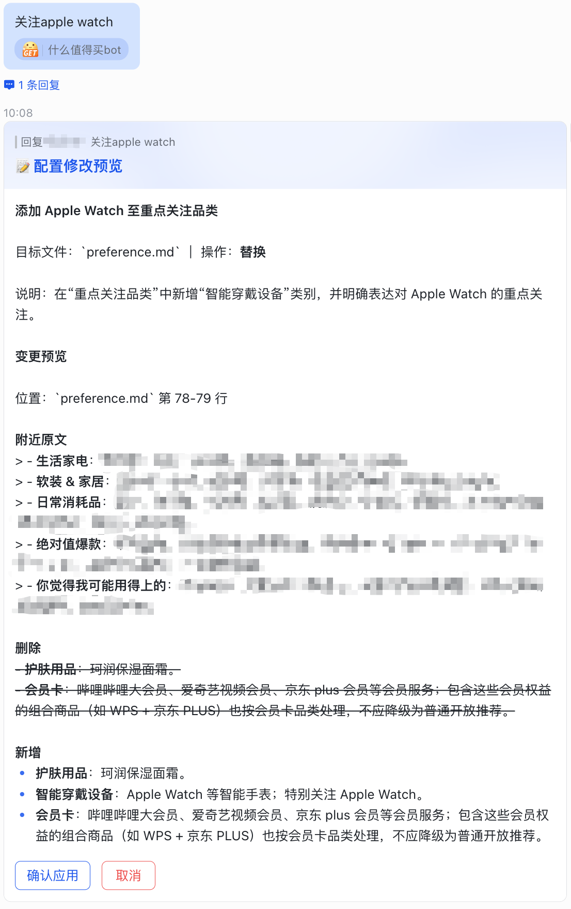
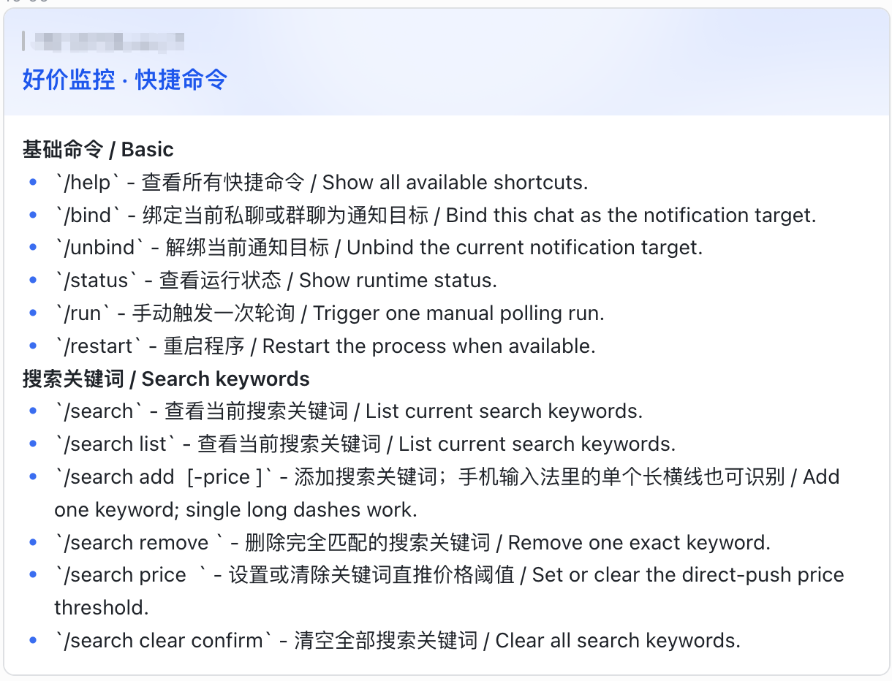

# SMZDM 好价提醒机器人

定时监控什么值得买好价榜单和关键词搜索结果，用 LLM 结合购物偏好和库存状态筛选商品，推送到飞书。

## 功能

**智能筛选**

- LLM 结合购物偏好（`preference.md`）和库存状态（`inventory.md`）判断是否推送
- 可开启双重判断模式：两次独立 LLM 筛选 + 仲裁 agent 分析不一致原因，选择更准确的结果
- 仲裁发现筛选规则缺陷时自动生成偏好优化建议，飞书一键采纳或忽略

**多来源监控**

- 轮询 SMZDM 多个好价榜单（综合榜、热卖榜、热搜榜等十几个分类）
- 关键词搜索来源，支持价格阈值，命中后跳过 LLM 直接推送
- 心跳通知：长时间未推送时自动提醒，确认监控正常运行

**飞书交互**

- 自建应用机器人推送卡片消息
- 交互命令管理偏好、库存和搜索关键词
- 自然语言修改偏好/库存（如「抽纸还剩 3 包」），预览确认后写入
- 商品卡片快捷操作：忽略同类、库存充足、关注跟踪

**稳定可靠**

- 24 小时去重，避免重复推送
- 夜间汇总当日未推送的疑似好价，方便回查是否有漏推和筛选规则优化空间
- 本地 `workspace/` 保存日志、状态和配置备份

## 效果示例

**好价推送卡片**


**自然语言修改偏好**



**支持快捷命令**



## 快速开始

### 安装

需要 Python 3.9+。

```bash
git clone <repo-url> smzdm_notice
cd smzdm_notice
python3 -m venv .venv
source .venv/bin/activate
pip install -U pip
pip install -e .
smzdm-notice setup
```

`setup` 会创建 `.env`、`preference.md`、`inventory.md` 和 `workspace/` 目录，已有文件不覆盖。

### 配置

编辑 `.env`，填写以下必填项：

| Key | 含义 | 格式示例 |
|-----|------|---------|
| `FEISHU_APP_ID` | 飞书应用 App ID | `cli_xxx` |
| `FEISHU_APP_SECRET` | 飞书应用 Secret | |
| `SMZDM_CLIENT_PLATFORM` | SMZDM App 平台，支持 `iphone` / `android` | `iphone` |
| `SMZDM_APP_VERSION` | SMZDM App 版本号 | `11.1.70` |
| `SMZDM_SIGN_KEY` | SMZDM App 接口签名 key | |
| `SMZDM_USER_AGENT` | SMZDM App 请求 User-Agent | |
| `LLM_API_KEY` | LLM API 密钥 | |
| `LLM_BASE_URL` | LLM 接口地址（OpenAI 兼容） | `https://api.deepseek.com/v1` |
| `LLM_MODEL` | 模型名称 | `deepseek-chat` |
| `RANKING_NAMES` | 监控榜单，逗号分隔；留空抓全部 | `综合榜-全部,综合榜-食品生鲜` |

可选榜单：综合榜-全部、综合榜-电脑数码、综合榜-白菜、综合榜-食品生鲜、综合榜-运动户外、综合榜-家用电器、综合榜-服饰鞋包、综合榜-日用百货、综合榜-母婴用品、综合榜-家居家装、综合榜-办公设备、综合榜-个护化妆、综合榜-本地生活、综合榜-医疗健康、综合榜-图书文娱、综合榜-玩模乐器、热卖榜、热评榜、热搜榜。

**SMZDM 配置：** 安卓和 iPhone 的签名 key 可能不同，`SMZDM_CLIENT_PLATFORM`、`SMZDM_APP_VERSION`、`SMZDM_SIGN_KEY` 和 `SMZDM_USER_AGENT` 应来自同一平台和相近 App 版本。请自行从 GitHub 公开仓库的 SMZDM 签到、脚本或 bot 实现中查找当前可用的签名 key 和 UA，例如：

- https://github.com/Cat-zaizai/ZaiZaiCat-Checkin
- https://github.com/enwaiax/smzdm_bot
- https://github.com/hex-ci/smzdm_script

这些值可能随 SMZDM App 版本变化而失效；如果抓取接口返回签名、权限或请求异常，优先检查平台、版本、签名 key 和 UA 是否匹配且仍然有效。

**可选配置：**

| 分类 | Key | 说明 |
|------|-----|------|
| LLM | `LLM_DUAL_FILTER` | 双重判断模式（默认 `false`） |
| LLM | `LLM_MAX_RETRIES` | OpenAI SDK 自动重试次数（默认 `2`） |
| LLM | `LLM_TIMEOUT_SECONDS` | 主筛选 LLM 请求超时秒数（默认 `300`） |
| LLM | `LLM_ARBITER_ENABLED` | 仲裁 agent（默认 `true`） |
| LLM | `LLM_ARBITER_API_KEY/BASE_URL/MODEL` | 仲裁专用 LLM，不填复用主配置 |
| LLM | `LLM_ARBITER_TIMEOUT_SECONDS` | 仲裁 LLM 请求超时秒数，不填复用主超时 |
| LLM | `LLM_DRAFT_API_KEY/BASE_URL/MODEL` | 草案专用 LLM，不填复用仲裁配置 |
| LLM | `LLM_DRAFT_TIMEOUT_SECONDS` | 草案 LLM 请求超时秒数，不填复用仲裁超时 |
| 预筛选 | `PREFILTER_ENABLED` | 启用粗筛（默认 `false`） |
| 预筛选 | `PREFILTER_MIN_WORTHY/COMMENTS/FAVORITES` | 最低准入阈值 |
| 预筛选 | `PREFILTER_BYPASS_ENABLED` | 强信号直通（默认 `false`） |
| 轮询 | `POLL_INTERVAL_MINUTES` | 轮询间隔（默认 `30`） |
| 轮询 | `HEARTBEAT_HOURS` | 心跳间隔（默认 `6`） |
| 轮询 | `FETCH_INTERVAL_SECONDS` | 榜单抓取间隔（默认 `5`） |
| 排行 | `TOP_N` | 每个榜单条数（默认 `20`） |
| 搜索 | `SEARCH_KEYWORDS_FILE` | 关键词文件路径（默认 `search_keywords.json`） |
| 去重 | `DEDUP_EXPIRE_HOURS` | 去重过期时间（默认 `24`） |
| 汇总 | `DIGEST_HOUR` | 夜间汇总时间（默认 `22`） |

**偏好与库存：** 编辑 `preference.md` 写购物偏好，编辑 `inventory.md` 写库存状态，两者会完整提供给 LLM。

**搜索关键词：** 可选创建 `search_keywords.json`：

```json
{
  "keywords": [
    { "keyword": "AirPods Pro 2", "max_price": 1200 },
    { "keyword": "充电宝" }
  ]
}
```

### 飞书机器人

使用飞书开放平台企业自建应用，长连接模式，无需公网回调。

1. 创建企业自建应用，添加「机器人」能力
2. 复制 App ID 和 App Secret，填入 `.env`
3. 申请权限：`im:message:send_as_bot`、`im:resource`、`im:message.reactions:write`、私聊 `im:message.p2p_msg:readonly`、群聊 `im:message.group_at_msg:readonly`
4. 事件与回调选择「使用长连接接收事件」，订阅 `im.message.receive_v1`
5. 卡片回调开启「卡片回传交互」，SDK key 为 `card.action.trigger`
6. 保存并发布应用

启动后在飞书私聊或群聊 @机器人 发送 `/bind` 完成绑定。绑定前不会轮询。

### 运行

```bash
smzdm-notice doctor   # 检查环境配置
smzdm-notice run      # 启动
```

不在项目目录时加 `--root /path/to/smzdm_notice`。

## 飞书命令

| 命令 | 说明 |
|------|------|
| `/bind` | 绑定通知目标 |
| `/unbind` | 解绑 |
| `/help` | 帮助 |
| `/status` | 监控状态 |
| `/run` | 手动触发轮询 |
| `/restart` | 重启 |
| `/search` | 查看搜索关键词 |
| `/search add <关键词> -price <价格>` | 添加关键词；手机输入法里的单个长横线也可识别 |
| `/search price <关键词> <价格>` | 设置价格阈值 |
| `/search price <关键词> clear` | 清除价格阈值 |
| `/search remove <关键词>` | 删除关键词 |
| `/search clear confirm` | 清空所有关键词 |

也可以用自然语言发给机器人修改偏好或库存（如"抽纸还剩 3 包"），机器人会先发预览，确认后写入。

## 后台运行

**nohup**（Linux / macOS）：

```bash
nohup .venv/bin/smzdm-notice run &
```

**caffeinate**（macOS，防止系统休眠）：

```bash
caffeinate -i .venv/bin/smzdm-notice run &
```

**systemd**（Linux）：

```ini
[Unit]
Description=SMZDM Notice Bot
After=network-online.target

[Service]
Type=simple
WorkingDirectory=/opt/smzdm_notice
ExecStart=/opt/smzdm_notice/.venv/bin/smzdm-notice run
Restart=always
RestartSec=10

[Install]
WantedBy=multi-user.target
```


## 开发者

```bash
pip install -e ".[dev]"
pytest -q
ruff check .
ruff format --check .
python -m pyright
tabnanny -q src tests
```

配置备份与 diff：

```bash
smzdm-notice save-config
smzdm-notice diff-config --list
smzdm-notice diff-config
smzdm-notice diff-config 1 2
```

## 免责声明

- 本项目仅供个人学习研究使用，不得用于商业用途。
- 签名算法、签名 key 和 User-Agent 获取方式来源于 GitHub 公开仓库，数据获取方式可能涉及平台服务条款，使用者需自行评估合规性并遵守相关条款。
- 因使用本项目导致的账号风险、数据争议或其他任何损失，开发者不承担责任。
- 如相关平台提出异议，本项目将配合处理。

## 关于本项目

本项目代码由 AI 编写，开发者仅提供需求描述和方向指导。由于代码完全由 AI 生成，可能存在逻辑缺陷或不够优雅的实现。如果你在使用中遇到问题，或有改进建议，欢迎提 Issue 或 PR。
