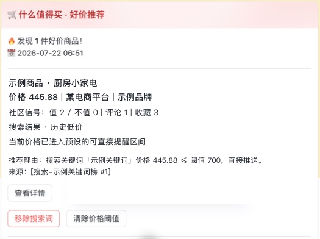
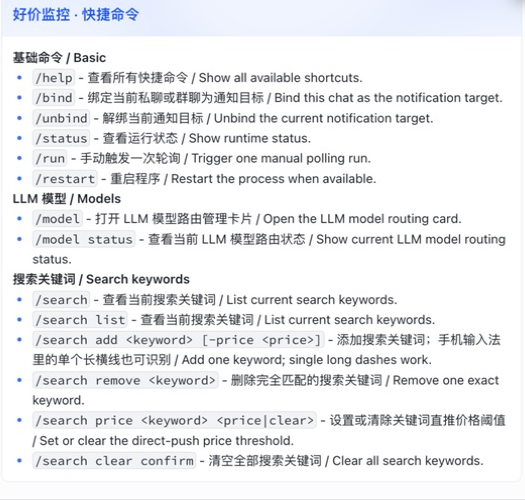
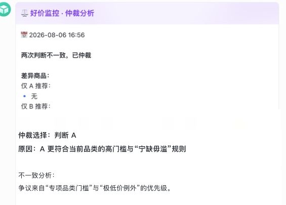
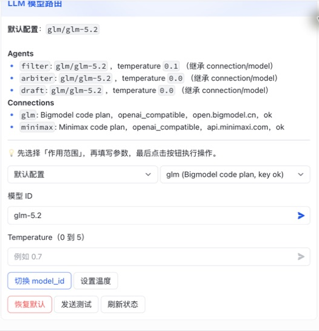
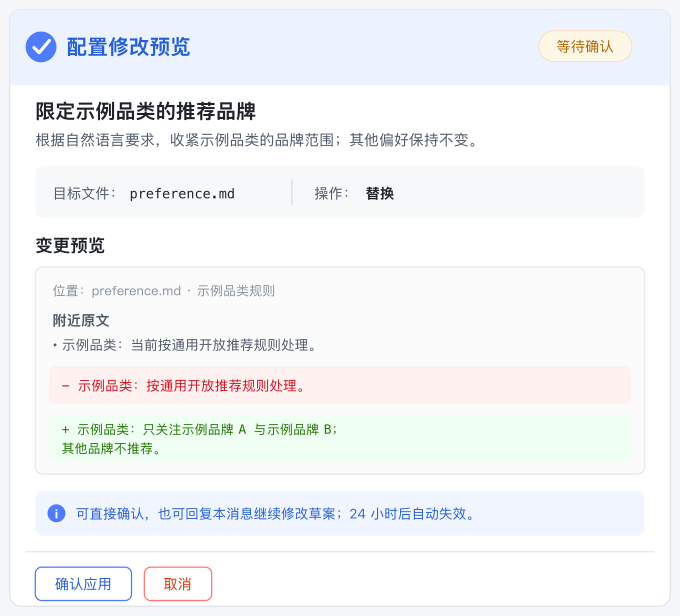

<div align="center">

<h1>🛒 SMZDM 好价提醒机器人</h1>

<p><strong>别让“好价”变成噪音。</strong></p>

<p>聚合什么值得买榜单与关键词搜索，用 LLM 结合偏好、库存和历史反馈筛选真正值得打扰的商品，<br>
并在飞书里完成查看、反馈、模型切换与规则调整。</p>

<p><code>Python 3.9+</code> · <code>Feishu Bot</code> · <code>OpenAI-compatible LLM</code> · <code>Local-first</code></p>

<p>✅ 无需配置 SMZDM 账号或登录 Cookie · 无需抓包维持个人登录态</p>

<p><a href="#功能全景">功能全景</a> · <a href="#效果预览">效果预览</a> · <a href="#快速开始">快速开始</a> · <a href="#飞书命令">飞书命令</a></p>

</div>

| 🎯 少打扰 | 🔎 不漏捡 | 🧠 越用越懂 |
|---|---|---|
| 偏好、库存、价格与价值信号共同决策，减少“便宜但不需要” | 双路判断、仲裁分析与 near-miss 回查，解释为什么推、为什么跳过 | 好价/不值反馈按品类形成校准案例，配置变更始终先预览再确认 |

### 一轮推荐如何产生

| ① 聚合 | ② 去重与粗筛 | ③ 个性化判断 | ④ 飞书交互 | ⑤ 持续校准 |
|---|---|---|---|---|
| 榜单 + 关键词搜索 | 去重、价格阈值、可选数值预筛 | 偏好 + 库存 + 历史反馈 + 可选双路仲裁 | 商品卡片、快捷操作、模型与状态管理 | Deal Memory、偏好草案、near-miss 夜间汇总 |

## 功能全景

| 能力 | 具体做法 | 好用在哪里 |
|---|---|---|
| **无需登录 Cookie** | 榜单与关键词搜索不依赖个人账号登录态，只需配置同一 App 平台/版本对应的签名 key 和 User-Agent | 不用抓取、导出或定期更新 Cookie，降低首次部署门槛，也避免把个人账号凭据交给机器人 |
| **19 个内置榜单 + 关键词搜索** | 覆盖 16 个综合榜分类、热卖榜、热评榜、热搜榜和任意搜索词；30 天前的过期搜索结果自动丢弃 | 既能广撒网发现意外好价，也能盯住具体型号；单个来源失败不会拖垮整轮抓取 |
| **完整的 `/search` 管理** | 在飞书中查看、添加、精确删除和清空关键词，也能单独设置或清除价格阈值 | 不需要登录服务器编辑 JSON；关键词在下一轮抓取前自动刷新 |
| **价格阈值直推** | 搜索商品存在明确数值价格且 `价格 ≤ max_price` 时跳过 LLM，直接发卡片 | 对“到了这个价就提醒我”的商品更快、更确定，也不消耗模型调用 |
| **分层筛选** | 先去重，再按值票、值率、评论、收藏做可选预筛，最后交给 LLM 综合判断 | 低信号商品不浪费 token；评论或值票特别高的商品可通过强信号通道进入复核 |
| **偏好 + 库存联合决策** | 每轮重新读取完整 `preference.md` 与 `inventory.md`，同时结合价格、品牌、社区信号和场景 | 能区分“客观便宜”和“现在值得提醒”；临时读文件失败会沿用最后一次成功内容 |
| **双路判断与仲裁** | 两次筛选并行执行；结果不一致时由 arbiter 比较差异、选边并解释争议 | 不只给结论，还能暴露规则歧义、ID 引用错误或模型过度保守/宽松的问题 |
| **near-miss 漏推回查** | 保存“本身像好价、但因个人条件跳过”的商品，夜间生成汇总 | 可回看系统是否错过边界商品；超过 20 条时附加完整 Markdown 文件，发送成功才清空 |
| **Deal Memory 反馈学习** | “好价 / 不值”可切换、取消，并能补充不值理由；历史案例按品类注入后续判断 | 学习的是同类商品的近期正反例，不会把一次点击直接固化成永久规则 |
| **自然语言安全改配置** | 聊天文字或商品卡片快捷操作先生成定位、原文和增删预览；支持回复旧预览继续修订 | 只有确认后才写 `preference.md` / `inventory.md`，并自动备份、审计、去重和 24 小时失效 |
| **多模型运行时路由** | filter / arbiter / draft 可继承默认连接，也可分别覆盖模型、connection 和 temperature | 在飞书卡片里测试或热切模型，下一次调用生效；JSON 原子写回，`doctor` 可提前校验配置 |
| **可靠投递与运行保护** | 发送成功后才写去重和待反馈记忆；大卡片自动拆分，部分失败只记录已送达商品 | 失败商品仍能在后续重试；手动轮询和定时轮询互斥，避免两轮重复工作 |
| **飞书内运维** | `/status`、`/run`、`/restart`、心跳、启停消息和连续失败告警 | 不看服务器也能知道机器人是否存活、上次何时成功，以及当前使用的路由和配置 |

### `/search`：把关键词变成可编程提醒

| 命令 | 用途 | 细节 |
|---|---|---|
| `/search` 或 `/search list` | 查看全部关键词及其 `max_price` | 不修改配置 |
| `/search add <关键词>` | 添加普通搜索词 | 已存在时幂等返回，不会重复写入 |
| `/search add <关键词> -price <价格>` | 添加搜索词并同时设置直推阈值 | 兼容手机输入法常见的单个长横线字符 |
| `/search price <关键词> <价格>` | 修改已有关键词的直推阈值 | 关键词需精确匹配，价格必须为正数 |
| `/search price <关键词> clear` | 只清除该关键词的价格阈值 | 保留关键词，后续商品恢复进入普通 LLM 流程 |
| `/search remove <关键词>` | 精确删除一个关键词 | 商品直推卡片也提供“移除搜索词”按钮 |
| `/search clear confirm` | 清空全部搜索词 | 必须显式提供 `confirm`，避免误操作 |

> [!IMPORTANT]
> `max_price` 是**直推阈值**，不是搜索结果的硬过滤线。价格不高于阈值时直接提醒；高于阈值、价格不是纯数值或没有配置阈值时，商品仍可进入普通去重、预筛与 LLM 判断流程。

```text
搜索结果
  ├─ 明确数值价格 ≤ max_price → 直接推送 → 查看详情 / 移除搜索词 / 清除价格阈值
  └─ 其他情况                  → 去重与预筛 → LLM 判断 → 好价反馈 / 配置快捷操作
```

价格阈值直推不会写入 Deal Memory，也不会用该结果训练偏好；即使本轮 LLM 服务异常，已命中阈值的商品仍会单独尝试投递。

## 效果预览

> [!NOTE]
> 截图已按当前卡片版本重新获取。交互结构来自真实 bot 消息；姓名和个性化规则已裁剪，商品、品牌、平台与搜索词使用中性示例文字替换。

### 从发现好价到一键反馈

<p align="center">
  
  <br><sub>当前推荐卡片：价值信号、推荐理由、好价反馈和配置快捷操作同时可见。</sub>
</p>

<table>
  <tr>
    <td width="50%" valign="top">
      <strong>价格阈值命中后直接推送</strong><br><br>
      
      <br><sub>绕过 LLM 与 Deal Memory，按钮切换为“移除搜索词 / 清除价格阈值”。</sub>
    </td>
    <td width="50%" valign="top">
      <strong>完整的 `/search` 命令</strong><br><br>
      
      <br><sub>查看、添加、精确删除、设置或清除阈值，以及带确认口令的全部清空。</sub>
    </td>
  </tr>
  <tr>
    <td width="50%" valign="top">
      <strong>双路判断不一致后的仲裁</strong><br><br>
      
      <br><sub>展示差异商品、最终选择、争议原因和 Prompt 优化建议。</sub>
    </td>
    <td width="50%" valign="top">
      <strong>运行时模型路由</strong><br><br>
      
      <br><sub>查看 filter / arbiter / draft 最终路由，切换模型、温度并发送测试。</sub>
    </td>
  </tr>
  <tr>
    <td width="50%" valign="top">
      <strong>两类反馈、三种配置动作</strong><br><br>
      
      <br><sub>好价 / 不值进入反馈记忆；不再推荐、库存足够和关注会生成配置草案。</sub>
    </td>
    <td width="50%" valign="top">
      <strong>运行状态</strong><br><br>
      
      <br><sub>查看轮询是否执行中，以及最近开始、完成和成功推送时间。</sub>
    </td>
  </tr>
</table>

<details>
<summary><strong>更多示例：自然语言配置草案</strong></summary>
<br>
<p align="center">
  <br>
  <sub>自然语言修改偏好或库存时，先给出定位和增删预览，确认后才写入。</sub>
</p>
</details>

## 核心能力

### 多来源监控与分层筛选

- 同时轮询综合榜各分类、热卖榜、热评榜、热搜榜，以及自定义关键词搜索；每个来源独立失败不会中断其他来源。
- 在调用 LLM 前先过滤去重记录，避免重复提醒和无效模型开销；默认去重窗口为 24 小时。
- 关键词可设置最高价。搜索结果价格命中阈值时直接推送，不进入 LLM，也不参与 Deal Memory 学习；卡片会改为提供“移除搜索词/清除价格阈值”操作。
- 可选数值预筛选，综合“值”票数、值率、评论和收藏减少低信号候选；也可配置评论数或值票数达到强信号条件时进入 LLM 复核。
- 每轮筛选前重新读取 `preference.md`、`inventory.md` 和关键词配置；临时读取失败时沿用上一次成功内容并发送节流告警。

### 个性化决策与双路仲裁

- LLM 同时读取完整购物偏好和库存状态，返回推荐项、推荐理由、品类、决策上下文，以及“本身像好价但因个人条件跳过”的 near-miss。
- 默认使用一次筛选；开启双重判断后执行两次独立筛选。结果不一致时，仲裁 agent 会比较差异、选择更可信的判断并解释原因。
- 仲裁发现偏好规则存在歧义时，会尝试生成 `preference.md` 修改草案；只有用户在飞书确认后才会写入，无法形成安全草案时仅展示建议。
- near-miss 会在夜间汇总，帮助回查潜在漏推；条目较多时自动附加 Markdown 文件，发送成功后才清空当天记录。

### 反馈记忆与持续校准

- 开启 Deal Memory 后，LLM 推荐卡片提供“好价/不值”反馈；“不值”可补充原因，再次点击可取消或改判。
- 反馈按商品品类保存。达到最少样本数后，同品类的近期正反例会作为校准案例加入后续筛选，而不是把单次反馈直接固化成永久规则。
- 每日分析达到样本门槛的历史反馈，识别稳定偏好模式并生成配置修改草案；仍需用户确认。连续分析失败达到上限后暂停当天重试，不阻塞 near-miss 汇总。

### 飞书内完成日常管理

- 使用企业自建应用的长连接收取消息与卡片回调，无需部署公网回调地址；支持私聊或群聊绑定通知目标。
- 自然语言修改 `preference.md` 或 `inventory.md`：先生成带定位、附近原文和增删预览的草案，可回复原预览继续修订，确认后再写入。
- 草案 24 小时后自动失效；应用前会备份原文件并写入审计日志。商品卡片上的“不再推荐/库存足够/关注”同样先生成草案，不会直接改配置。
- `/search` 系列命令管理关键词和价格阈值；`/model` 卡片可查看、测试和热切换 filter / arbiter / draft 的连接、模型与 temperature。
- 只有当前绑定用户可以解绑通知目标或操作卡片，重复消息事件会在进程内幂等处理。

### 运行状态与故障提醒

- 长时间没有商品推送时发送心跳；启动、停止、重启、配置读取异常和连续轮询失败都会给出飞书提示。
- 好价卡片发送成功后才写入去重和待反馈记忆；部分卡片发送失败时只持久化已送达商品，后续仍可重试失败项。
- 卡片会按飞书组件数和消息体积限制自动拆分；图片上传失败时保留商品图片链接。
- 本地 `workspace/` 分别保存运行状态、日志、配置审计和备份，便于排查与回滚。

## 快速开始

### 安装

需要 Python 3.9+。

```bash
git clone <repo-url> smzdm_notice
cd smzdm_notice
python3 -m venv .venv
source .venv/bin/activate
pip install -U pip
pip install -e .
smzdm-notice setup
```

`setup` 会创建 `.env`、`llm_models.json`、`preference.md`、`inventory.md` 和 `workspace/` 目录，已有文件不覆盖。

### 配置

编辑 `.env`，填写以下必填项：

> [!TIP]
> **不需要 SMZDM 账号、密码或登录 Cookie。** 本项目抓取榜单和搜索结果时不使用个人登录态，也不要求抓包导出 Cookie；`SMZDM_SIGN_KEY` 和 `SMZDM_USER_AGENT` 用于构造对应 App 平台/版本的接口请求，不是用户的账号凭据。这样既简化了部署，也不会因为个人登录 Cookie 过期而中断监控。

| Key | 含义 | 格式示例 |
|-----|------|---------|
| `FEISHU_APP_ID` | 飞书应用 App ID | `cli_xxx` |
| `FEISHU_APP_SECRET` | 飞书应用 Secret | |
| `SMZDM_CLIENT_PLATFORM` | SMZDM App 平台，支持 `iphone` / `android` | `iphone` |
| `SMZDM_APP_VERSION` | SMZDM App 版本号 | `11.1.70` |
| `SMZDM_SIGN_KEY` | SMZDM App 接口签名 key | |
| `SMZDM_USER_AGENT` | SMZDM App 请求 User-Agent | |
| `LLM_DEEPSEEK_API_KEY` | 默认 `llm_models.json` 引用的 DeepSeek API 密钥 | |
| `RANKING_NAMES` | 监控榜单，逗号分隔；留空抓全部 | `综合榜-全部,综合榜-食品生鲜` |

可选榜单：综合榜-全部、综合榜-电脑数码、综合榜-白菜、综合榜-食品生鲜、综合榜-运动户外、综合榜-家用电器、综合榜-服饰鞋包、综合榜-日用百货、综合榜-母婴用品、综合榜-家居家装、综合榜-办公设备、综合榜-个护化妆、综合榜-本地生活、综合榜-医疗健康、综合榜-图书文娱、综合榜-玩模乐器、热卖榜、热评榜、热搜榜。

**SMZDM 配置：** 安卓和 iPhone 的签名 key 可能不同，`SMZDM_CLIENT_PLATFORM`、`SMZDM_APP_VERSION`、`SMZDM_SIGN_KEY` 和 `SMZDM_USER_AGENT` 应来自同一平台和相近 App 版本。请自行从 GitHub 公开仓库的 SMZDM 签到、脚本或 bot 实现中查找当前可用的签名 key 和 UA，例如：

- https://github.com/Cat-zaizai/ZaiZaiCat-Checkin
- https://github.com/enwaiax/smzdm_bot
- https://github.com/hex-ci/smzdm_script

这些值可能随 SMZDM App 版本变化而失效；如果抓取接口返回签名、权限或请求异常，优先检查平台、版本、签名 key 和 UA 是否匹配且仍然有效。

**可选配置：**

| 分类 | Key | 说明 |
|------|-----|------|
| LLM | `LLM_DUAL_FILTER` | 双重判断模式（默认 `false`） |
| LLM | `LLM_ARBITER_ENABLED` | 仲裁 agent（默认 `true`） |
| LLM | `LLM_MODELS_FILE` | 多 connection/agent 路由配置文件（默认 `llm_models.json`） |
| 预筛选 | `PREFILTER_ENABLED` | 启用粗筛（默认 `false`） |
| 预筛选 | `PREFILTER_MIN_WORTHY/COMMENTS/FAVORITES` | 最低准入阈值 |
| 预筛选 | `PREFILTER_BYPASS_ENABLED` | 强信号直通（默认 `false`）；开启后会在 LLM 输入中补充强信号说明，避免仅因基础值率被否定 |
| 轮询 | `POLL_INTERVAL_MINUTES` | 轮询间隔（默认 `30`） |
| 轮询 | `HEARTBEAT_HOURS` | 心跳间隔（默认 `6`） |
| 轮询 | `FETCH_INTERVAL_SECONDS` | 榜单抓取间隔（默认 `5`） |
| 排行 | `TOP_N` | 每个榜单条数（默认 `20`） |
| 搜索 | `SEARCH_KEYWORDS_FILE` | 关键词文件路径（默认 `search_keywords.json`） |
| Deal Memory | `DEAL_MEMORY_ENABLED` | 启用好价/不值反馈记忆（默认 `false`） |
| Deal Memory | `DEAL_MEMORY_FILE` | 反馈记忆文件路径（默认 `workspace/state/deal_memory.json`） |
| Deal Memory | `DEAL_MEMORY_EXPIRE_DAYS` | 已反馈记录保留天数（默认 `90`） |
| Deal Memory | `DEAL_MEMORY_PENDING_EXPIRE_DAYS` | 待反馈推荐记录保留天数（默认 `30`） |
| Deal Memory | `CALIBRATION_MAX_EXAMPLES` | 每类注入 prompt 的历史案例上限（默认 `5`） |
| Deal Memory | `CALIBRATION_MIN_CATEGORY_RECORDS` | 每类至少多少条历史反馈才注入校准案例（默认 `2`） |
| Deal Memory | `MEMORY_PATTERN_MIN_SAMPLES` | 触发偏好模式分析的最少反馈样本数（默认 `3`） |
| 去重 | `DEDUP_EXPIRE_HOURS` | 去重过期时间（默认 `24`） |
| 汇总 | `DIGEST_HOUR` | 夜间汇总时间（默认 `22`） |

**偏好与库存：** 编辑 `preference.md` 写购物偏好，编辑 `inventory.md` 写库存状态，两者会完整提供给 LLM。

**Deal Memory：** 设置 `DEAL_MEMORY_ENABLED=true` 后，推荐卡片会显示「好价/不值」反馈按钮。推送成功的 LLM 推荐会先进入待反馈记录，用户点击反馈后进入长期记忆；夜间汇总前会尝试更新历史决策校准和偏好学习建议。Deal Memory 是辅助功能，连续分析失败达到上限后会放弃当天分析并继续发送 near-miss 夜间汇总。

**LLM 多模型路由：** `setup` 会生成 `llm_models.json` 并默认启用多模型路由。JSON 中只保存 `api_key_env`，真实密钥继续放 `.env`，例如 `LLM_DEEPSEEK_API_KEY=...`。运行时必须有 `llm_models.json`。

配置分三层：`connections` 保存 OpenAI 兼容接口连接，`defaults` 保存默认 connection/model_id/request 参数，`agents.filter/arbiter/draft` 只写覆盖项；未配置的 agent（包括 `draft`）会继承 defaults。`timeout_seconds/max_retries` 可写在 defaults、connection 或 agent 上，优先级为 agent > connection > defaults。运行时内置默认 `response_format={"type":"json_object"}`，即使 JSON 里省略该字段也会发送；用户可用非空 `response_format` 对象覆盖。agent request 中字段值为 `null` 表示继承默认值，不会关闭默认 `response_format`。

`request.extra_body` 会按默认或 agent 覆盖原样透传给 OpenAI SDK，项目不校验 provider 字段含义。不同 provider 支持字段不同，例如 BigModel/智谱可用 `{"do_sample":false}` 降低随机漂移，或用 `{"thinking":{"type":"disabled"}}` 关闭 thinking；vLLM/SGLang 常见写法是 `{"chat_template_kwargs":{"enable_thinking":false}}`。

飞书发送 `/model` 会打开 LLM 模型路由管理卡片，可在卡片中查看当前默认配置和 `filter/arbiter/draft` 的最终路由，选择作用范围、选择已加载 connection、输入 model_id、设置 temperature、reset agent 覆盖并做测试调用。

热切只修改已加载 connection 下的 `defaults` 或 `agents` 覆盖项；新增或修改 `base_url/provider/api_key_env`、修改 `.env` 密钥后需要重启。写回使用唯一临时文件和原子替换；多实例同时热切时以后写入者为准。

**搜索关键词：** 可选创建 `search_keywords.json`：

```json
{
  "keywords": [
    { "keyword": "AirPods Pro 2", "max_price": 1200 },
    { "keyword": "充电宝" }
  ]
}
```

关键词也可以完全通过飞书 `/search` 系列命令维护。`max_price` 表示“命中后绕过 LLM 直接提醒”的价格，不会过滤掉更高价商品；配置文件只接受带 `keyword` / `max_price` 字段的对象条目，重复关键词读取时自动去重。

### 飞书机器人

使用飞书开放平台企业自建应用，长连接模式，无需公网回调。

1. 创建企业自建应用，添加「机器人」能力
2. 复制 App ID 和 App Secret，填入 `.env`
3. 申请权限：`im:message:send_as_bot`、`im:resource`、`im:message.reactions:write`、私聊 `im:message.p2p_msg:readonly`、群聊 `im:message.group_at_msg:readonly`；流式更新还必须开通 `cardkit:card:write`
4. 事件与回调选择「使用长连接接收事件」，订阅 `im.message.receive_v1`
5. 卡片回调开启「卡片回传交互」，SDK key 为 `card.action.trigger`
6. 保存并发布应用

启动后在飞书私聊或群聊 @机器人 发送 `/bind` 完成绑定。绑定前不会轮询。

卡片使用 JSON 2.0，建议接收端使用飞书 7.20 或以上版本。

> **流式更新必需权限：** 在飞书开放平台的「权限管理」中开通「创建与更新卡片」（`cardkit:card:write`）。新增权限后需要重新发布应用版本，并确认租户管理员已完成授权，然后重启本服务。该权限用于创建 CardKit 卡片实体、实时更新模型输出并在完成后替换为可交互预览；未授权或 CardKit 调用失败时，机器人会自动回退到静态普通 2.0 卡片，不展示流式内容。

### 运行

```bash
smzdm-notice doctor   # 检查环境配置
smzdm-notice run      # 启动
```

不在项目目录时加 `--root /path/to/smzdm_notice`。

## 飞书命令

| 命令 | 说明 |
|------|------|
| `/bind` | 绑定通知目标 |
| `/unbind` | 解绑 |
| `/help` | 帮助 |
| `/status` | 监控状态 |
| `/run` | 手动触发轮询 |
| `/restart` | 重启 |
| `/model` | 打开 LLM 模型路由管理卡片 |
| `/model status` | 查看 filter / arbiter / draft 当前最终路由 |
| `/search`、`/search list` | 查看搜索关键词和各自的直推价格阈值 |
| `/search add <关键词>` | 添加普通关键词；重复添加不会产生重复条目 |
| `/search add <关键词> -price <价格>` | 添加关键词并设置直推阈值；手机输入法里的单个长横线也可识别 |
| `/search price <关键词> <价格>` | 设置直推阈值：价格命中时跳过 LLM 直接提醒 |
| `/search price <关键词> clear` | 清除直推阈值，但保留关键词 |
| `/search remove <关键词>` | 精确删除一个关键词 |
| `/search clear confirm` | 清空所有关键词，必须带 `confirm` 防误操作 |

也可以用自然语言发给机器人修改偏好或库存（如“某类耗材还剩 3 件”）。机器人会先发预览；可以点击确认/取消，也可以直接回复这张预览补充修改意见。商品卡片上的“不再推荐/库存足够/关注”也走同一套草案确认流程。

## 后台运行

**nohup**（Linux / macOS）：

```bash
nohup .venv/bin/smzdm-notice run &
```

**caffeinate**（macOS，防止系统休眠）：

```bash
caffeinate -i .venv/bin/smzdm-notice run &
```

**systemd**（Linux）：

```ini
[Unit]
Description=SMZDM Notice Bot
After=network-online.target

[Service]
Type=simple
WorkingDirectory=/opt/smzdm_notice
ExecStart=/opt/smzdm_notice/.venv/bin/smzdm-notice run
Restart=always
RestartSec=10

[Install]
WantedBy=multi-user.target
```


## 开发者

```bash
pip install -e ".[dev]"
pytest -q
ruff check .
ruff format --check .
python -m pyright
tabnanny -q src tests
```

配置备份与 diff：

```bash
smzdm-notice save-config
smzdm-notice diff-config --list
smzdm-notice diff-config
smzdm-notice diff-config 1 2
```

## 免责声明

- 本项目仅供个人学习研究使用，不得用于商业用途。
- 签名算法、签名 key 和 User-Agent 获取方式来源于 GitHub 公开仓库，数据获取方式可能涉及平台服务条款，使用者需自行评估合规性并遵守相关条款。
- 因使用本项目导致的账号风险、数据争议或其他任何损失，开发者不承担责任。
- 如相关平台提出异议，本项目将配合处理。

## 关于本项目

本项目代码由 AI 编写，开发者仅提供需求描述和方向指导。由于代码完全由 AI 生成，可能存在逻辑缺陷或不够优雅的实现。如果你在使用中遇到问题，或有改进建议，欢迎提 Issue 或 PR。
